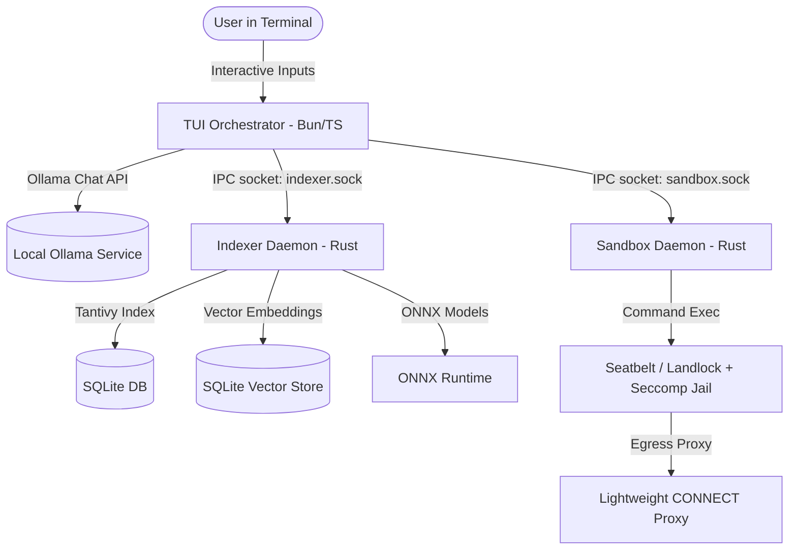

# UNIT-01: Comprehensive Architecture & Codebase Explanation

Welcome to **UNIT-01**, a local, agentic AI coding assistant designed to run locally on your machine. It orchestrates local LLM inference, secure sandbox execution, and codebase semantic indexing to paired-program with developers directly in their terminals.

This document details the system's architecture, daemons, algorithms, data structures, and APIs.

---

## 1. Architectural Overview

UNIT-01 is composed of three core parts:

1. **TUI & LLM Orchestrator (TypeScript / Bun)**: The interactive Terminal User Interface (TUI) that coordinates the agent's main loops, communicates with Ollama, and queries the two local daemons.
2. **Sandbox Daemon (Rust)**: A secure execution environment designed to execute shell commands under strict kernel isolation.
3. **Indexer Daemon (Rust)**: A background indexing service that handles file analysis, AST-based code chunking, dependency graphing, full-text, and vector searches.

### System Topology & IPC Communication

All sibling daemons interact over local Unix Domain Sockets (or local TCP on Windows) to avoid network dependencies:

*   **IPC Socket Paths**: Centralized under `/tmp/ruthen/` on Unix platforms:
    *   **Sandbox socket**: `/tmp/ruthen/sandbox.sock`
    *   **Indexer socket**: `/tmp/ruthen/indexer.sock`
    *   **Orchestrator socket**: `/tmp/ruthen/orchestrator.sock`

---

## 2. The Sandbox Daemon (`sandbox`)

Located at [UNIT-01/sandbox](file:///Users/lichi/ruthen/UNIT-01/sandbox), this Rust-based daemon is responsible for **securely executing arbitrary commands** generated by the LLM (via the `run_command` tool). It isolates the execution sub-process from your system using multiple layers of kernel containment.

### 2.1 sandboxing Features

#### macOS Isolation (Seatbelt Sandbox)
Enforced via Apple's proprietary Seatbelt sandboxing profile under `/usr/bin/sandbox-exec`. 
*   **Allowed Paths**: Full Read/Write is permitted only within the active **workspace directory** and a uniquely-generated **isolated temp directory**.
*   **System Read-Only Paths**: Access is restricted to compiler and runtime dependencies: `/usr/lib`, `/System/Library`, `/usr/bin`, `/bin`, `/usr/sbin`, `/sbin`, `/usr/local/bin`, `/usr/local/lib`, `/usr/share`, `/etc`, and `/dev`.
*   **Credential Scoping**: Explicitly blocks reading sensitive user credentials from the home directory: `~/.ssh`, `~/.aws`, `~/.config/git`, `~/.gnupg`, `~/.netrc`, `~/.npmrc`, `~/.docker`, `~/.kube`, `~/.azure`, and `~/.gpg`.

#### Linux Isolation (Landlock LSM + Seccomp-BPF)
*   **Landlock LSM**: Restricts filesystem access. Allows full Read/Write/Execute only on the workspace and isolated temp folder, and grants read-only access to `/lib`, `/lib64`, `/usr/lib`, `/usr/lib64`, `/bin`, `/usr/bin`, `/sbin`, `/usr/sbin`, `/usr/local/bin`, `/usr/share`, `/usr/local/lib`, `/etc/ld.so.cache`, `/etc/ld.so.conf`, `/etc/ld.so.conf.d`, `/etc/localtime`, and `/proc/self`.
*   **Seccomp-BPF System Call Filtering**: Traps and terminates (`KillProcess`) any process executing system calls associated with privilege escalation or container escapes, including:
    *   `unshare`, `mount`, `umount2`, `pivot_root`, `chroot`, `ptrace`, `process_vm_writev`, `process_vm_readv`, `clone3`, `setns`, `kexec_load`, `kexec_file_load`, `init_module`, `finit_module`, `delete_module`, `perf_event_open`, and `kcmp`.
    *   If `deny_network` is true, network system calls like `connect`, `bind`, `listen`, `accept`, `accept4`, `sendto`, `recvfrom`, `sendmsg`, and `recvmsg` are blocked.
    *   Filters `socket()` calls to allow only local Unix Domain Sockets (`AF_UNIX = 1`), killing processes attempting internet domain sockets (`AF_INET = 2` or `AF_INET6 = 10`).

#### POSIX Resource Limits
Applies limits in the child process immediately after forking (in the fork-gap `pre_exec`):
*   **Virtual Memory Space (`RLIMIT_AS`)**: Capped at **512 MB**.
*   **File Descriptors (`RLIMIT_NOFILE`)**: Capped at **256**.
*   **Process count (`RLIMIT_NPROC`)**: Capped at **20** on Linux.

### 2.2 Egress HTTP CONNECT Proxy
To allow package installation or API queries (when network access is requested by tools), the sandbox spawns a local HTTP CONNECT proxy (`SandboxProxy`) bound to `127.0.0.1`.
*   **Allowlist Discovery**: Scans lockfiles (`package-lock.json`, `yarn.lock`, `pnpm-lock.yaml`, `Cargo.lock`) inside the workspace to extract hostnames from package registries (e.g. `registry.npmjs.org`, `crates.io`).
*   **Static Ecosystems**: Hosts preconfigured allowed domain lists for ecosystems (e.g., `node`, `python`, `rust`, `go`, `github`, `brew`, `infra` containing providers like Anthropic and OpenAI).
*   **Enforcement**: Non-allowed outgoing connections return `HTTP 403 Forbidden` back to the command run.

### 2.3 Secret Redaction Scanner
The stdout and stderr of executed commands are scanned in real-time by a regex-based redaction compiler. Sensitive API tokens and credentials matching the following formats are scrubbed out with `[REDACTED <Label>]`:
*   **AWS Access Key**: `AKIA[0-9A-Z]{16}`
*   **AWS Secret Key**: `(?i)aws.{0,30}['\"][0-9a-zA-Z\/+]{40}['\"]`
*   **GitHub Token**: `gh[pousr]_[0-9a-zA-Z]{36}`
*   **npm Token**: `npm_[a-zA-Z0-9]{36}`
*   **Slack Token**: `xox[baprs]-[0-9a-zA-Z-]{10,50}`
*   **Bearer Token**: `(?i)(?:Authorization|authorization):\s*Bearer\s+[a-zA-Z0-9._-]{20,}`
*   **SSH Private Key**: `(?s)-----BEGIN ... PRIVATE KEY-----.+?-----END ... PRIVATE KEY-----`
*   **JWT Token**: `eyJ[a-zA-Z0-9_-]+\.eyJ[a-zA-Z0-9_-]+\.[a-zA-Z0-9_-]+`
*   **Generic Credentials**: Key names containing `secret`, `password`, `token`, `auth`, `api_key` mapped to a string value exceeding 16 characters.

### 2.4 JSON-RPC Socket API Methods
*   `execute` / `cage_execute`: Run command synchronously inside the isolated sandbox.
*   `execute_stream` / `cage_execute_stream`: Spawns process and streams output (line-by-line) back to the socket.
*   `set_workspace`: Locks sandbox operations to a directory.
*   `set_policy`: Dynamically toggles sandbox parameters (`enabled`, `deny_network`, `allowed_domains`, `excluded_commands`, `allow_write_paths`, `deny_write_paths`, `deny_read_paths`).

---

## 3. The Code Indexer Daemon (`indexer`)

Located at [UNIT-01/indexer](file:///Users/lichi/ruthen/UNIT-01/indexer), this Rust service manages structural chunking, dependency graphing, full-text indexing, and semantic searches of the code workspace.

### 3.1 AST-Aware Structural Chunker
Rather than slicing source code blindly, the indexer groups lines into logical entities: functions, structs, classes, methods, and modules.
*   **Tree-Sitter Parsing**: Attempts to parse files with tree-sitter AST parsers for `Rust`, `Python`, `JavaScript`, `TypeScript`, and `Go` to isolate node boundaries.
*   **Regex-Based Fallback**: If tree-sitter is missing, regex boundary detection extracts chunks. Example patterns:
    *   **Rust**: `fn`, `pub fn`, `struct`, `enum`, `impl`, `trait`, `mod`, `macro_rules!`, `#[test]`.
    *   **Python**: `def`, `async def`, `class`, decorators.
    *   **JavaScript/TypeScript**: `function`, `export class`, `export interface`, arrow functions, `lexical_declarators`.
    *   **Go**: `func`, `type ... struct`, `type ... interface`.
*   **Supported Languages**: Rust, Go, Python, JavaScript, TypeScript, Java, C, C++, Ruby, Swift, Kotlin, Scala, PHP, Shell, Lua, Zig.

### 3.2 Dependency Graph (`petgraph`)
Built on top of `petgraph::graph::DiGraph`, this module resolves imports and exports to track relationships between files:
*   **Exports extraction**: Parses public functions, classes, enums, interfaces, or structs.
*   **Imports resolution**: Detects imports like `use` in Rust, `import` in Python/Go, and `require` or `import` in JS/TS.
*   **Graph operations**:
    *   `dependencies_of`: Direct outgoing edges.
    *   `dependents_of`: Direct incoming edges.
    *   `transitive_dependents`: Follows incoming edges recursively to build the list of files affected if the target is modified.
    *   `impact_analysis`: Evaluates the "blast radius" of changing a file (summarized as direct + transitive dependents).
    *   `find_file_by_export`: Resolves which file exports a given symbol.

### 3.3 Hybrid Search & Fusion Algorithms

The indexer merges keyword-based indexing with natural language semantics:

1.  **Full-Text Search**: Powered by the **Tantivy** search library. It indexes individual lines within structural code chunks.
2.  **Semantic Vector Search**: Stores float arrays in a SQLite database (`vectors.db`).
    *   **ONNX Embedder (`OrtEmbedder`)**: Runs the ONNX model (typically `all-MiniLM-L6-v2`) via the HuggingFace `tokenizers` and the `ort` library. 
    *   **Fallback Hash Embedder (`HashEmbedder`)**: A local algorithm that builds token hashes for offline usage (see section 3.4).

#### Reciprocal Rank Fusion (RRF)
Fuses BM25 keyword rankings and semantic vector search rankings using the RRF algorithm. The fusion score is computed as:
$$RRF\_Score(d) = \sum_{m \in M} \frac{1}{60.0 + r_m(d)}$$
where:
*   $M$ represents the set of retrieval models (Tantivy BM25 + Vector Search).
*   $60.0$ is the smoothing constant ($k$).
*   $r_m(d)$ is the 1-based rank of code chunk $d$ in the output of model $m$.

#### Cross-Encoder Reranking
Top-ranked results from RRF are fed into an ONNX-backed Cross-Encoder (`CrossEncoder`) model. It scores candidate-query relevance by formatting the input sequence:
`[CLS] <query> [SEP] <candidate_filepath> <candidate_content> [SEP]`
Reranking improves local search quality by calculating deep query-document interactions.

### 3.4 Mathematical Formulas & Embedder Mechanics

#### 1. Fallback Term-Hashing Embedder (`HashEmbedder`)
Calculates a deterministic 256-dimension vector for offline environments:
*   Splits text into terms (alphanumeric words where length > 1).
*   **Term hashing**: Each term $t$ is hashed using FNV-1a (in client) or Rust's `DefaultHasher` (in daemon) to index $idx$:
    $$idx = hash(t) \pmod{256}$$
    Increment vector: $\vec{v}[idx] \leftarrow \vec{v}[idx] + 1.0$
*   **Bigram hashing**: For every consecutive pair of terms $(t_i, t_{i+1})$:
    $$idx = hash(t_i + \text{" "} + t_{i+1}) \pmod{256}$$
    Increment vector: $\vec{v}[idx] \leftarrow \vec{v}[idx] + 0.5$
*   **L2-Normalization**:
    $$\vec{v}_{norm} = \frac{\vec{v}}{\|\vec{v}\|_2} = \frac{\vec{v}}{\sqrt{\sum_{i=1}^{256} v_i^2}}$$

#### 2. Cosine Similarity
Calculates similarity between vectors $\vec{a}$ and $\vec{b}$. Since both the ONNX models and the HashEmbedder output normalized unit vectors ($\|\vec{a}\|_2 = \|\vec{b}\|_2 = 1.0$), cosine similarity is simplified to the dot product:
$$\text{Sim}(\vec{a}, \vec{b}) = \vec{a} \cdot \vec{b} = \sum_{i=1}^{D} a_i b_i$$

#### 3. ONNX Mean Pooling
ONNX models return token embeddings. To compile these into a single chunk embedding, we extract the `last_hidden_state` tensor of dimension $[1, \text{SequenceLength}, \text{HiddenDimension}]$ and pool them:
$$\vec{v}_{pooled} = \frac{1}{N} \sum_{i: \text{mask}[i]=1} \vec{e}_i$$
where $\vec{e}_i$ is the embedding vector for token $i$, and $N$ is the count of non-padded tokens (`attention_mask[i] == 1`). The resulting pooled vector is L2-normalized.

### 3.5 Shadow Backups & Rollbacks
To prevent irreversible data corruption:
*   Before any `write` or `patch` operation executes, the indexer computes a SHA-256 hash of the target file's path.
*   The original content of the file is written to `[TEMP]/ruthen/indexer_shadow/<path_hash>.bak`.
*   An entry is added to `manifest.json`.
*   The `/undo` command reads this manifest to restore files to their pre-write state.

---

## 4. TUI & Client Orchestrator (`cli`)

Located at [UNIT-01/cli](file:///Users/lichi/ruthen/UNIT-01/cli), this Bun/TypeScript application controls the terminal UI views and coordinates conversational agent steps.

### 4.1 UI Views and Elements
*   **Boot / Welcome View**: Diagnostic onboarding screen. Tests connection to local Ollama. Shows daemon status. Lets the user select an LLM from available local tags.
*   **Chat View**: Virtualized message viewport supporting mouse-wheel scrolling, page up/down, and collapsible blocks (e.g., hiding/showing LLM thoughts or tool execution logs).
*   **Slash Command Dropdown**: Real-time dropdown menu that matches inputs beginning with `/` to commands or parameters.
*   **Permission Dialog**: Intercepts actions requiring approval (e.g., executing a shell command) and displays a modal prompt.
*   **Diff Modal**: Displays file modifications side-by-side using the `diff` package and terminal colors before saving.

### 4.2 Executor Agentic Loop
The core loop inside `AgenticExecutor` controls tool-invocation turns:

1.  **System Prompt Composition**: Prepares a system prompt containing the active working directory and rules for tool usage. Prepend project-specific guidelines from a custom context file (discovery matches `UNIT.md` or similar in the workspace).
2.  **Model Adaptation**: Checks the parameter size of the model. If running a smaller model (e.g., $\le$ 8B parameters), it trims the system prompt to use simplified constraints and slices chat history to only the last 4 turns.
3.  **Inference streaming**: Streams chat completion from Ollama. Collects text deltas and tool invocation blocks.
4.  **Sequential Execution**: For each tool requested:
    *   **Permission Mode Check**:
        *   `plan`: Blocks all modifications and executes.
        *   `ask`: Prompts the user via permission modals or diff confirmation before writes.
        *   `auto-edit`: Auto-applies edits, but asks for shell commands.
        *   `auto`: Automatically executes everything based on a built-in safety classifier.
        *   `yolo`: Executes all tools with no confirmations.
    *   **Scrubbing**: Feeds command output to the secret redaction engine before sending the result back to the LLM.

---

## 5. Built-in Tools Reference

The LLM can call the following tools:

| Tool Name | Risk Level | Category | Description |
| :--- | :--- | :--- | :--- |
| `read_file` | Safe | Read | Reads lines from a file. Supports line ranges (`start_line` to `end_line`). Truncates if $\ge$ 50 KB. |
| `list_directory` | Safe | Read | Lists files in a directory to map workspace folders. |
| `search_files` | Safe | Read | Finds files matching a glob pattern (e.g. `src/**/*.go`). |
| `find_files` | Safe | Read | Locates files by matching exact basename. |
| `search_code` | Safe | Read | Keyword-based BM25 code search across indexed files. |
| `semantic_search` | Safe | Analyze | CONCEPT-based code search using embeddings. |
| `find_dependents` | Safe | Analyze | Identifies files that depend on (import/depend on) the specified file path. |
| `find_dependencies` | Safe | Analyze | Identifies imports/dependencies inside the specified file path. |
| `impact_analysis` | Safe | Analyze | Traverses the dependency graph to evaluate modification blast-radius. |
| `web_search` | Safe | Read | Performs search using Tavily, Brave Search, or DuckDuckGo APIs. |
| `write_file` | Moderate | Write | Saves full file contents to the workspace, creating a shadow backup. |
| `patch_file` | Moderate | Write | Replaces a specific matching substring in a file. |
| `patch_file_blocks` | Moderate | Write | Applies unified Search/Replace blocks (using `<<<<<<< SEARCH`, `=======`, `>>>>>>> REPLACE` markers). |
| `run_command` | Dangerous | Execute | Runs a shell command inside the Landlock/Seccomp isolated sandbox. |

---

## 6. Built-in Slash Commands

Type these commands directly in the TUI input field:

*   `/help`: Opens the interactive help screen displaying keybindings.
*   `/init`: Generates a standard `UNIT.md` project context file in the current directory.
*   `/model [<name>]`: Switches the active LLM. Opens an interactive dropdown list if no name is provided.
*   `/mode [<mode>]`: Sets permission autonomy: `plan`, `ask`, `auto-edit`, `auto`, or `yolo`.
*   `/thinking [on\|off]`: Toggles the visibility of thinking/reasoning blocks streamed from reasoning models.
*   `/doctor`: Displays status info of daemons, model parameters, and token consumption metrics.
*   `/index`: Forces the indexer to scan and build index metadata for the active workspace.
*   `/shadow`: Lists all available backup files stored in the shadow rollback folder.
*   `/undo`: Restores all workspace files to their state prior to the agent's edits.
*   `/deps [<file>]`: Lists dependencies and dependents of the specified file.
*   `/impact [<file>]`: Prints the transitive impact report (change blast-radius).
*   `/compress`: Compresses early chat transcripts into summaries to free context window budget.
*   `/clear`: Resets active chat view messages and clears screen history.
*   `/save [<name>]`: Saves the current chat session to state directory.
*   `/resume [<name>]`: Reloads and resumes a previously saved session.
*   `/new`: Starts a clean session, clearing history.
*   `/theme`: Changes interface theme options (coming soon).
*   `/quit` / `/exit`: Shuts down the UI and exits.
