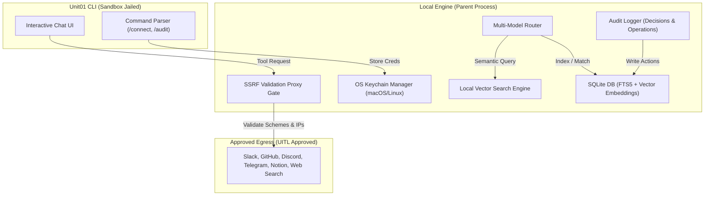
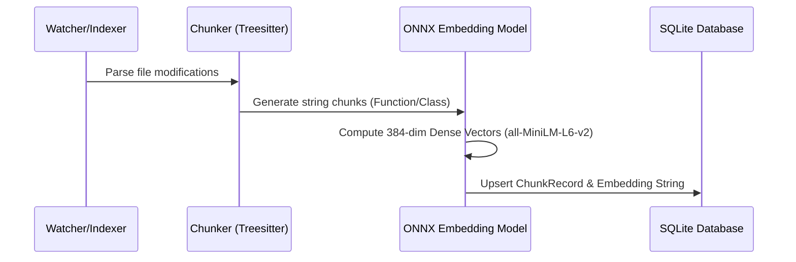
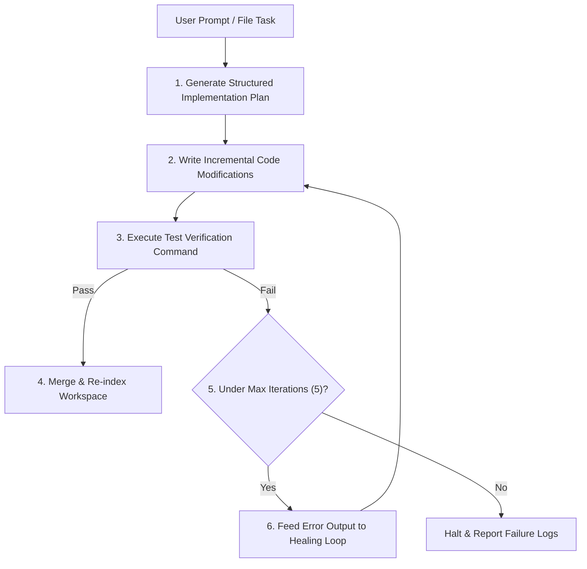

# Unit01 Pro: Complete Specification & Architectural Blueprint

This document defines the product features, backend designs, security threat models, and architectural specifications for **Unit01 Pro** (Connect Tier, $20/month or $200/year). It outlines five core technical pillars designed specifically for local-first, privacy-paranoid developer workflows.

---

## 1. Product Positioning: The Anti-Cloud Wedge

Most coding assistants assume unlimited cloud budgets and zero privacy constraints. They send codebase contexts, active files, and sensitive credentials directly to remote servers, leaving developers vulnerable to IP leaks and security policy violations.

**Unit01 Connect** takes the opposite approach:
1. **100% Local-First by Default:** All indexers, database operations, and credential storage run strictly on the developer's machine.
2. **Strict User-in-the-Loop (UITL) Gate:** The agent is sandbox-jailed. It cannot call system commands, make network queries, or post data to whitelisted endpoints without explicit, blocking confirmation.
3. **No Hidden Telemetry:** Zero analytics, zero logging to cloud servers, and zero remote tracking.

---

## 2. Five-Pillar Feature Specifications



### Pillar 1: Unified Service Gateway (`/connect`)

An interactive, inline secure authentication command inside the CLI interface, designed to securely manage API tokens for external services (Slack, Discord, Telegram, Notion, GitHub, GitLab, and Web Search) without risking exposure in plain text logs, configuration files, or shell histories (e.g. `~/.zsh_history`).

#### A. Interactive User Experience (UX) Flow
1. The developer types `/connect` in the active terminal chat.
2. The CLI renders an interactive arrow-key selection menu:
   ```
   ॐ  unit01 connect  ·  Select Service to Authenticate
   ─────────────────────────────────────────────────
   > [ ] GitHub
     [ ] GitLab
     [ ] Slack
     [ ] Notion
     [ ] Discord
     [ ] Telegram
     [ ] Web Search
   ```
3. Upon selecting a service, the prompt dynamically requests credentials with masked, secure text entry:
   ```
   🔑 Enter GitHub Personal Access Token (PAT): ****************************************
   ```
4. The CLI runs validation in the background using the Sanskrit spinner:
   ```
   ॐ Validating GitHub credentials...
   ```
5. On success, the token is saved into the native credential store and the UI shows:
   ```
   ✓ Successfully connected GitHub!
   ```

#### B. Storage Architecture
To prevent compiling dependencies (like `keytar`) from breaking on headless setups or operating systems, Unit01 implements custom native wrappers:
* **macOS:** Operates directly on the system keychain using `/usr/bin/security`.
  ```bash
  # Store token securely
  security add-generic-password -a "unit01" -s "unit01-github" -w "<token>" -U
  # Retrieve token
  security find-generic-password -a "unit01" -s "unit01-github" -w
  ```
* **Linux:** Uses an owner-only configuration file (`~/.unit01/credentials.json`, locked via `chmod 600`) encrypted with **AES-256-GCM**.
  * **One Master Password:** A single master password acts as the combination lock to the entire vault. Unlocking it decrypts all service tokens (all "drawers") at once for the active session.
  * **Session-Scoped In-Memory Cache:** The Master Password is input *once* per session when Connect features are first accessed. The decrypted credentials are kept strictly in-memory during execution and never written to disk.
  * **Master Recovery Key (1Password Style):** 
    * During initial master password setup, the CLI generates a 24-character security recovery key (e.g. `UNIT01-GARR-YSLK-GHUB-BBUG-LOCK`).
    * The user is prompted to copy this key and store it safely.
    * **Reset Flow:** If the developer forgets their password, they run `/reset-password` in the CLI. Pasting the recovery key unlocks the vault, letting them set a new master password without losing their whitelisted service tokens.

#### C. Safe Web Search (Strict API-Only, No Arbitrary URL Scraping)
To completely eliminate the risk of Server-Side Request Forgery (SSRF) and Indirect Prompt Injection (IPI) from sketchy websites, **Unit01 Connect has no arbitrary page reader or scraper (`read_url`)**. 
* **Mechanism:**
  1. **Strict Search Gating:** The agent is only equipped with a `web_search` tool. It cannot fetch or browse raw URLs (like YouTube links, random blogs, or arbitrary HTTP paths).
  2. **API-Scoped Snippets:** The tool queries Google Custom Search API or DuckDuckGo Lite API to retrieve *only* structured search metadata (Title, URL, and a 200-character text snippet). 
  3. **No Raw HTML Execution:** The engine never downloads raw HTML, parses scripts, or follows sub-links.
  4. **Two-Tier Search Model:**
     - **Core (Free):** Web searches query DuckDuckGo Lite's search index (best-effort, free, no-auth).
     - **Connect (Pro):** Web searches use Google Custom Search API with a **100 queries/day** quota (resets at midnight local developer time).
  5. **Google Quota Overflow & Fallback:**
     - When a Pro user hits query 101, the system auto-falls back to DDG search.
     - The CLI displays a clean notice on screen: `ॐ Google search quota (100/day) reached — switching to DuckDuckGo`.
     - The DDG fallback uses a light client-side throttle (e.g. 500ms delay between consecutive requests) to prevent IP blocks.
  6. **Custom Key Option (Unlimited):** If a Pro user wants guaranteed Google-quality search past the 100-query limit, they can input their own Google Custom Search API key inside the `/connect` menu.

---

### Pillar 2: Local Semantic Search (Vector Embeddings)

Codebase-wide semantic search utilizing locally-generated vector embeddings, allowing the agent to locate functions, classes, and logic blocks based on semantic meaning rather than exact word matches.

#### A. Embeddings Pipeline Architecture


#### B. Database Schema Expansion
The [src/db.ts](file:///Users/lichi/nayalabs/unit01/src/db.ts) file schema is updated to leverage sqlite-vss or a flat-float serialization table for similarity computation.
```sql
-- Existing chunks table updated
ALTER TABLE chunks ADD COLUMN embedding TEXT;

-- Indexing Metadata Table
CREATE TABLE IF NOT EXISTS embedding_metadata (
    chunk_id TEXT PRIMARY KEY,
    model_name TEXT NOT NULL,
    dimensions INTEGER NOT NULL,
    FOREIGN KEY(chunk_id) REFERENCES chunks(id) ON DELETE CASCADE
);
```

#### C. Search Strategy: Hybrid FTS5 + Semantic Match
1. **FTS5 Lexical Scan:** Queries the database using keyword matches to identify precise symbols (e.g., function names, variable references).
2. **Cosine Vector Match:** Generates an embedding of the user's natural language query using a lightweight local model (`all-MiniLM-L6-v2` compiled to ONNX, execution size ~45MB) running on the local CPU/GPU. Calculates cosine similarity across chunk vectors.
3. **Rank Merger:** Ranks results using Reciprocal Rank Fusion (RRF) to combine structural keywords and semantic intent.

---

### Pillar 3: Project Memory (Long-Term Context Store)

A persistent, local knowledge base that tracks architectural decisions, style patterns, refactoring history, and conventions specific to the active workspace. This prevents the agent from forgetting project rules when sessions end.

#### A. Database Schema
Created inside the workspace database directory (e.g. `~/.local/share/com.ruthenlabs.indexer/<hash>/memory.db`):
```sql
CREATE TABLE IF NOT EXISTS project_decisions (
    id TEXT PRIMARY KEY,
    timestamp INTEGER NOT NULL,
    category TEXT NOT NULL,         -- 'database', 'auth', 'styles', 'conventions'
    summary TEXT NOT NULL,          -- Brief summary of the decision
    rationale TEXT NOT NULL,        -- Why it was decided
    context_files TEXT,             -- JSON list of files involved
    active_session_id TEXT
);

CREATE TABLE IF NOT EXISTS user_conventions (
    key TEXT PRIMARY KEY,
    pattern TEXT NOT NULL,          -- e.g., "Use functional React components with tailwind"
    created_at INTEGER NOT NULL,
    last_triggered INTEGER NOT NULL
);
```

#### B. Storage & Retrieval Lifecycle
```
   [Active Chat Session] 
       │
       ├─► Agent makes an important design decision (e.g., "Switching auth from Firebase to custom JWT")
       │   └─► System intercepts and auto-inserts record into SQLite `project_decisions`
       │
   [New Session Opened]
       │
       ├─► System queries SQLite for active decisions & user conventions
       └─► Injects them as system guidelines under "Project Background & Conventions"
```

---

### Pillar 4: Local Audit Log & Action Replay

A local, queryable history of every operation executed by the `/connect` gateway and sandboxed shell executor. This serves as a safety mechanism, compliance log, and version control tool for agent actions.

#### A. Database Design
```sql
CREATE TABLE IF NOT EXISTS audit_logs (
    id TEXT PRIMARY KEY,            -- Secure UUID
    timestamp INTEGER NOT NULL,
    service TEXT NOT NULL,          -- 'github', 'slack', 'shell', 'file_write'
    operation TEXT NOT NULL,        -- 'read_messages', 'post_message', 'execute_script'
    target TEXT NOT NULL,           -- URL, file path, or channel name
    payload_summary TEXT NOT NULL,  -- Truncated summary of payload data
    payload_hash TEXT NOT NULL,     -- SHA256 of the complete payload (for validation)
    status TEXT NOT NULL,           -- 'approved', 'denied', 'failed'
    duration_ms INTEGER
);
```

#### B. CLI Interfaces & Commands
* `/audit list` - Displays the latest 15 actions with statuses:
  ```
  ॐ  unit01 audit log  ·  Recent Actions
  ──────────────────────────────────────
  [22:04:12]  ✓ Slack     read_messages   #general         Approved
  [22:05:01]  ✓ GitHub    open_pr         pull/104         Approved
  [22:08:43]  ✗ Shell     rm -rf build/   -                Denied
  ```
* `/audit inspect <id>` - Shows the complete payload body, parameters, and matching hashes.
* `/audit undo <id>` - Restores state. For file operations, it reverts to the matching [ShadowBackupRecord](file:///Users/lichi/nayalabs/unit01/src/db.ts#L38) database state. For whitelisted writes, it triggers deletion calls where supported (e.g., deleting a posted Slack message or closing an open PR).

---

### Pillar 5: Autopilot Pipeline (Plan-Code-Test-Healing Loop)

To increase developer velocity, Unit01 Connect introduces an autonomous background execution loop. When tasked with complex changes, the active local model can plan, edit, run tests, and automatically heal itself if errors occur, without manual developer intervention.



#### A. Structured Build Pipeline Flow
The core automation flow that ensures compilation safety and self-healing:
1. **Planning Step:** The model generates a structured implementation plan (steps, modified files, test changes).
2. **Code Edit Step:** Edits are written to the workspace (or a temporary git worktree) to isolate the changes.
3. **Compilation & Testing Step:** The runner compiles the project and executes the local test suite in background mode.
4. **Self-Healing Loop:**
   * If tests pass: Merges modifications back to the main working directory and prompts the user for confirmation.
   * If tests fail: Extracts stdout/stderr error logs, feeds them back to the active local model with debugging instructions, makes code adjustments, and re-compiles.
   * **Hard Cap:** Maximum of 5 self-healing iterations. If unresolved, it halts, presents the failure log, and returns control to the developer.

---

## 3. Tier Comparison: Free vs. Connect (Pro)

| Feature | Unit01 Core (Free) | Unit01 Connect (Pro) |
| :--- | :--- | :--- |
| **Integrations** | None (Local codebase analysis only) | Elite 7 Integrations via Secure Gateway (`/connect`) |
| **Credential Manager** | None | macOS Keychain & encrypted Linux Vault |
| **Search Engine** | Standard keyword FTS5 scanner | Hybrid Semantic + FTS5 search (Local ONNX) |
| **Context Retention** | Single-session history | Persistent SQLite Project Memory |
| **Audit Trails** | None | Structured Local Audit Log (`/audit`) |
| **Autopilot Execution** | Foreground execution only | Autonomous Plan-Code-Test-Healing Loop |
| **Data Privacy** | Local execution | Local execution + Strict Web Search snippet isolation |

---

## 4. Pros & Cons Analysis

### 1. Unified Service Gateway (`/connect`)
* **Pros:**
  * Clean developer UX; prevents credentials from showing up in shell history.
  * Native OS security wrappers avoid build failures during setup.
* **Cons:**
  * The session-scoped Master Password on Linux requires keyboard input once when starting work, creating slight initial friction.

### 2. Local Semantic Search (embeddings)
* **Pros:**
  * Better code search results for concepts that don't match exact keywords.
  * 100% local; code never leaves the developer's hardware.
* **Cons:**
  * Indexing large codebases (10,000+ files) can cause CPU spikes during initial startup vector generation.

### 3. Project Memory (Long-Term Context Store)
* **Pros:**
  * Keeps context window lean by injecting only relevant design conventions.
  * Solves "memory loss" across sessions.
* **Cons:**
  * Stale decisions or conventions can accumulate, requiring manual pruning utilities over time.

### 4. Local Audit Log & Action Replay
* **Pros:**
  * Provides transparency for security-conscious users.
  * Revert command (`/audit undo`) handles mistakes easily.
* **Cons:**
  * Reverting external APIs (like Slack posts or GitHub comments) depends on server APIs, which don't always support deletions.

### 5. Autopilot Pipeline (Plan-Code-Test-Healing Loop)
* **Pros:**
  * Background execution fixes compile bugs and verifies tests without user input.
  * Ensures codebase safety by testing changes before merging.
* **Cons:**
  * Repetitive test suite runs can increase token usage and execution time if the codebase is very large.

---

## 5. Security Threat Model & Defense-in-Depth

Connect operates with system credentials, giving it high exploit potential if compromised. We employ a layered safety design:

```
┌────────────────────────────────────────────────────────┐
│                   1. SYSTEM ISOLATION                  │
│  (Jailed container prevents filesystem escapes)        │
└───────────────────────────┬────────────────────────────┘
                            ▼
┌────────────────────────────────────────────────────────┐
│                   2. OUTBOUND PORT BLOCK               │
│  (Egress proxy restricts HTTP targets to whitelists)   │
└───────────────────────────┬────────────────────────────┘
                            ▼
┌────────────────────────────────────────────────────────┐
│               3. API-ONLY SNIPPET ISOLATION            │
│  (Blocks arbitrary URL fetches, preventing SSRF & IPI) │
└───────────────────────────┬────────────────────────────┘
                            ▼
┌────────────────────────────────────────────────────────┐
│                4. HUMAN CONFIRMATION (y/N)             │
│  (Intercepts payloads and prompts before execution)    │
└────────────────────────────────────────────────────────┘
```

1. **System Isolation:** Sandbox containment (macOS Seatbelt or Linux `bwrap`) blocks the agent from writing outside project paths or launching system binaries (`sudo`, `docker`).
2. **Outbound Gating:** The network proxy limits outgoing traffic to approved endpoints (GitHub, Slack, Discord, Telegram, Notion, DuckDuckGo, Google).
3. **API-Only Snippet Isolation:** The agent has **no arbitrary link scraping tools** (e.g. `<read_url>`). It can only query Google/DDG Search APIs, which only return sanitized, short metadata snippets. This prevents loading local network addresses (SSRF) and blocks hackers from serving hijacked commands through custom web scripts (IPI).
4. **Human Confirmation Gate:** The developer reviews outbound payloads (`[p] preview payload`) to verify that the agent is not posting sensitive assets or credentials to whitelisted domains.
